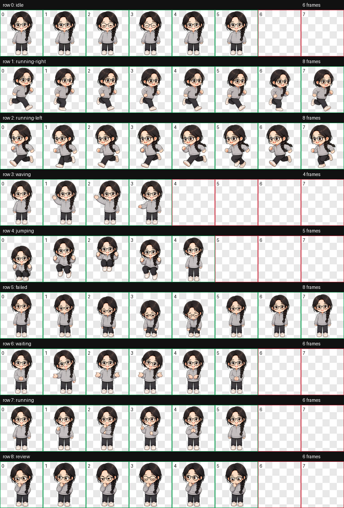

# Hatch Chibi Pet 🐣

**English** | [简体中文](README.zh-CN.md)

Turn any single-person photo into an installable **animated chibi pet for Codex**.

## Install in One Prompt

Paste this into Codex:

```text
Use $skill-installer to install this Skill:
https://github.com/cjx12036/hatch-chibi-pet/tree/main/skill/hatch-chibi-pet
```

Start a new task after installation, upload a single-person photo, and simply say:

```text
Turn this person into a chibi Codex pet.
```

Codex will match and use the Skill automatically from its description.

[](https://github.com/cjx12036/hatch-chibi-pet/releases)
[](LICENSE)
[](https://github.com/cjx12036/hatch-chibi-pet/actions/workflows/validate.yml)
[](skill/hatch-chibi-pet/SKILL.md)

## Chibi Pet Preview

| Chibi character | Animated Codex pet |
| :---: | :---: |
|  |  |

> Source photos are never included in this repository. Always obtain consent before publishing someone else's generated likeness.

## What It Does

- Creates a cute, big-headed character at roughly **2.5-head proportions** instead of a miniaturized realistic adult.
- Preserves recognizable features such as glasses, hairstyle, braids, and clothing colors.
- Generates all nine Codex states: idle, run left, run right, waving, jumping, failure, waiting, working, and reviewing.
- Produces a standard `1536×1872` transparent WebP spritesheet in a fixed `8×9` grid with `192×208` cells.
- Uses stable slot extraction, two-pass green-screen cleanup, per-frame QA, and motion-scale normalization to reduce green fringes, debris, jitter, and inconsistent character sizing.
- Packages and installs the finished pet into `~/.codex/pets/<pet-id>/`.

## Animation Preview

| Idle | Waving | Jumping | Running |
| --- | --- | --- | --- |
|  |  |  |  |

Complete nine-state contact sheet:



## Installation

The one-prompt `$skill-installer` method at the top is recommended. You can also install the Skill manually.

### Manual Option 1: Download a Release

Download `hatch-chibi-pet.zip` from the [latest release](https://github.com/cjx12036/hatch-chibi-pet/releases/latest), then extract it to:

```text
~/.codex/skills/hatch-chibi-pet/
```

### Manual Option 2: Git Clone

```bash
git clone https://github.com/cjx12036/hatch-chibi-pet.git
mkdir -p ~/.codex/skills
cp -R hatch-chibi-pet/skill/hatch-chibi-pet ~/.codex/skills/
```

After installation, start a new Codex task so the Skill can be discovered.

## Usage

Upload a clear photo containing one person, then enter:

```text
Use $hatch-chibi-pet to turn this person into an animated chibi Codex pet and install it.
```

You can also specify a name:

```text
Use $hatch-chibi-pet to create a chibi pet from this person. Name the new character YJY.
```

When generation is complete, open Codex and go to:

```text
Settings → Pets → Refresh → select the new pet → Show pet
```

## Workflow

1. Analyze the photo and extract 3–6 recognizable visual anchors.
2. Generate the key art with a fixed chibi body ratio.
3. Generate nine animation rows; left and right running are generated independently by default.
4. Remove green-screen spill and low-alpha color debris in two passes, then slice frames using stable slots.
5. Generate a contact sheet and GIF previews for structural and independent visual QA.
6. Output `pet.json` and `spritesheet.webp`, then install the pet.

## Repository Structure

```text
skill/hatch-chibi-pet/   Installable Codex Skill
assets/demo/             README animations and contact sheet
```

## Requirements

- Codex with the built-in `$imagegen` skill
- Python 3 with Pillow
- `jq`

Only use photos you have permission to process. Do not publish source portraits or generated likenesses without the person's consent.

## Contributing

Issues and pull requests are welcome. See [CONTRIBUTING.md](CONTRIBUTING.md). When reporting visual bugs, share the generated contact sheet and validation JSON when possible; do not attach private source portraits.

If this project is useful, consider starring the repository and sharing a generated pet demo. ⭐

## License

Apache License 2.0. See [LICENSE](LICENSE) and the bundled skill [NOTICE](skill/hatch-chibi-pet/NOTICE).
